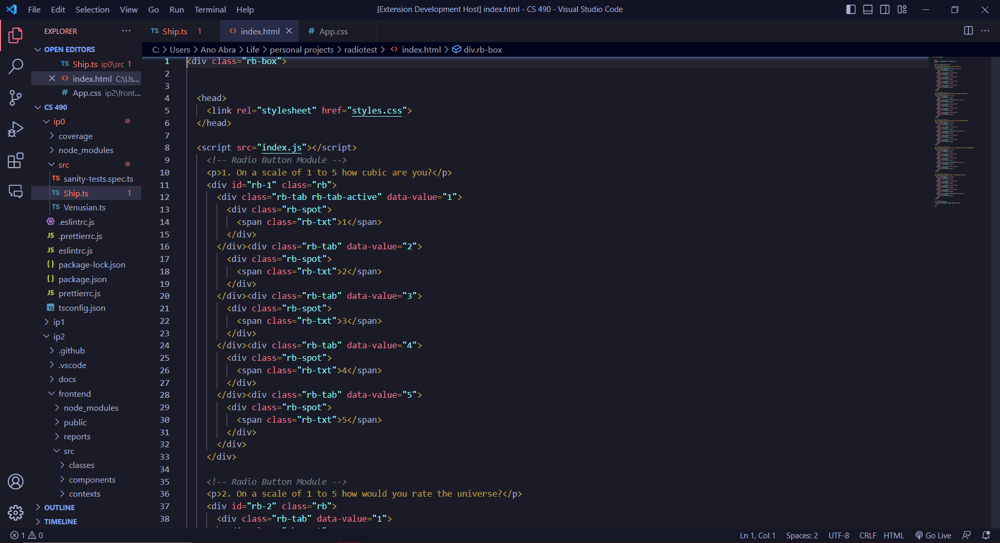
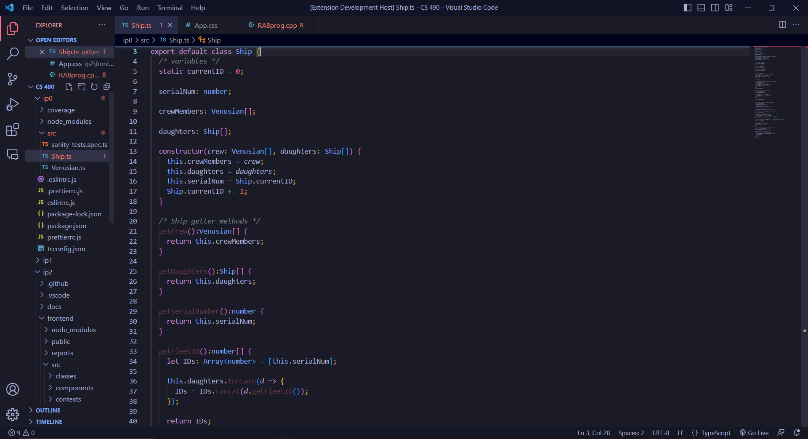

# Rocinante Color Theme

Theme based on the pinup art background image "rocinante.png" in the "Rocinante Backgrounds" folder of the show ["The Expanse"](https://www.imdb.com/title/tt3230854/)

For the backgrounds the creator of the ["rocinante.png"](https://github.com/A-Abra/rocinante-vscode/blob/main/Rocinante%20Backgrounds/rocinante.png) is unknown while the ["rocinante-original.png"](https://github.com/A-Abra/rocinante-vscode/blob/main/Rocinante%20Backgrounds/rocinante-original.png) is a photoshop from the "rocinante.png".

## Screenshots

### HTML

### CSS

### TYPESCRIPT

<!--
* Split the editor (`Cmd+\` on macOS or `Ctrl+\` on Windows and Linux).
* Toggle preview (`Shift+Cmd+V` on macOS or `Shift+Ctrl+V` on Windows and Linux).
* Press `Ctrl+Space` (Windows, Linux, macOS) to see a list of Markdown snippets.

## For more information

* [Visual Studio Code's Markdown Support](http://code.visualstudio.com/docs/languages/markdown)
* [Markdown Syntax Reference](https://help.github.com/articles/markdown-basics/)
-->
